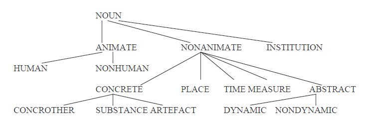

# Abstract nouns from RBN

The list of abstract nouns used by **LiNT-II** is taken from the Referentiebestand Nederlands (RBN), version 2.0.1.

This folder provides instructions on how to download and prepare the file that is used in the `lint_ii` package.

## Step-by-step instructions

1. **Download RBN**. The RBN is available for non-commercial use and can be downloaded [here](https://taalmaterialen.ivdnt.org/download/tstc-referentiebestand-nederlands/). You need to have an account with INT (Instituut voor de Nederlandse Taal) to download content from the website. The file is downloaded in the format of an Access database.

2. **Export xlsx file**.
    * Open the downloaded Access database (`RBN_2.0.mdb`).
    * From the table `Zelfstandige naamwoorden`, select the nouns that have the semantic type *dynamic* and *nondynamic* (see semantic type classification below). The SQL query:

        ```sql
        select [id-form], [morpho-plurform1], [morpho-plurform2]
        from [Zelfstandige naamwoorden]
        where [sem-type] in ('dynamic', 'nondynamic')
        ```

    * Save the query and export to Excel.
    * The xlsx file contains 15,914 rows (excl. header) and 3 columns: `id-form` (singular form, e.g. "*aangifte*"), `morpho-plurform1` (plural form 1, e.g. "*aangiften*"), `morpho-plurform2` (plural form 2, if avaialble, e.g. "*aangiftes*").

3. **Process xlsx into txt**. Use the script `abstract_nouns.py` to process the exported xlsx file into a txt file that contains a list of all the nouns (N=26,347).

4. **Use the list in LiNT-II**. The list is given as an argument when creating a `ReadabilityAnalysis` or `Sentence` object. See example in [README](../README.md).

## Semantic type classification in the RBN



Source: [RBN documentation](https://taalmaterialen.ivdnt.org/wp-content/uploads/documentatie/rbn_documentatie_nl.pdf)
